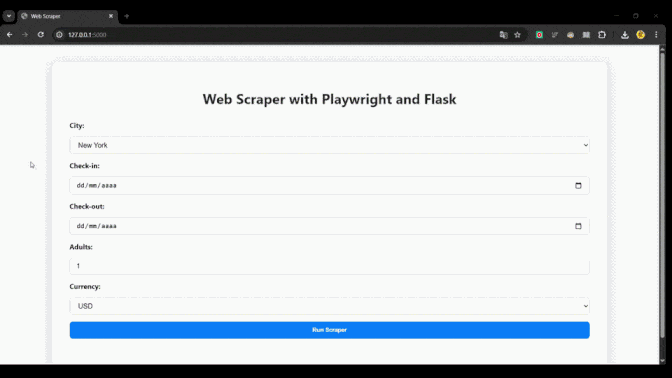
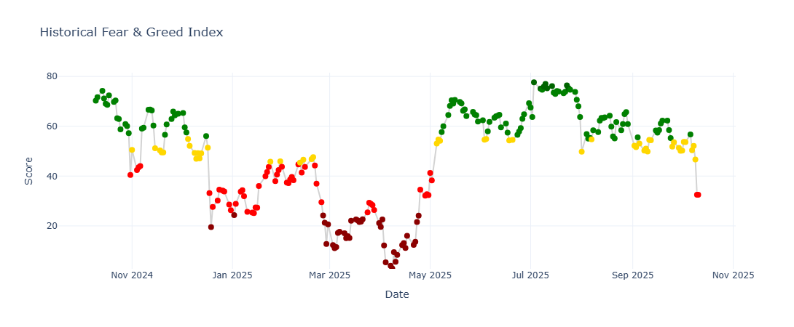

# 🧠 Bruno Augusto — Data Engineer | Web Scraping & Automation

Automated data pipelines, API integrations and data-driven systems built with Python, AWS, and modern ETL workflows.

---

## 🧭 Table of Contents
- [About Me](#-about-me)
- [Core Skills](#-core-skills)
- [Projects](#-projects)
- [Detailed Tech Stack](#-detailed-tech-stack)
- [Contact](#-contact)

---

### ⚙️ Tech Stack (summary)

---

## 👋 About Me

I’m **Bruno Augusto**, an **AWS Data Engineer** and **Web Scraper** with **4 years of experience** building scalable, cloud-based solutions.  
I am **AWS Certified**, skilled in designing **data pipelines, cloud automation, and containerized environments** to deliver high-quality, reliable results.  

---

## 💡 Core Skills

| Area | Skills & Tools |
|------|----------------|
| **Data Pipelines** | Apache Airflow, ETL workflows, Automation |
| **Cloud Computing (AWS)** | EC2, Lambda, API Gateway, DynamoDB, RDS, IAM, KMS, CloudWatch, Glue, S3, Athena, SES, EventBridge |
| **Containerization** | Docker, Docker Compose |
| **Programming & Web** | Python, Playwright, Flask, Pandas, SQLite, Jinja, HTML, CSS |

---

## 🚀 Projects

### Airbnb Scraping

  

**Description:**  
Automated scraping of Airbnb listings using Python. Project is containerized with Docker, modularized for scalability, and includes ETL-ready workflows.

**Tech Stack:** Python | Docker | Playwright | Pandas | SQLite  

[Explore Project Details →](projects/airbnb_scraper/README.md)

---

### 💼 Reuters Scraping
**Description:**  
Automated scraping of Reuters articles using Python. Built with a modular architecture for scalability and maintainability. Includes ETL-ready workflows and leverages advanced web scraping techniques such as automatic proxy rotation, captcha bypass, browser impersonation, and other strategies for robust and efficient data extraction.

**Tech Stack:** Python | Scrapy | Requests

[Explore Project Details →](projects/reuters_scraper/README.md)

---

### 💹 Market Valuation Scraper

  

**Description:** 
Automated extraction of market valuation indicators and sentiment data from multiple financial sources using Python. The project integrates non-official APIs with TLS fingerprinting and JSON parsing to retrieve, clean, and analyze market metrics such as momentum, volatility, and safe haven demand. It includes analytical visualization with Plotly and Pandas to generate insights — such as the Fear & Greed Index — presented in a Jupyter Notebook for exploration and reporting.

**Tech Stack:** Python | Requests | Pandas | JSON | Plotly | Jupyter Notebook | Unnoficial APIs | TLS Fingerprinting

[Explore Project Details →](projects/market_valuation_scraper/README.md)

---

### 🧩 Detailed Tech Stack

#### 🧠 Data Engineering

#### ☁️ Cloud & Automation

#### 🧰 DevOps & Infra

#### 🗃️ Databases

#### 💻 Web & Automation

#### 📊 Analytics & Visualization

---

## 📫 Contact

  
  &nbsp;
  

