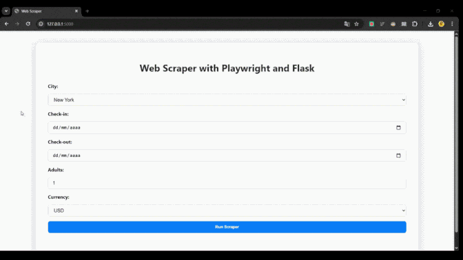

# Airbnb Scraping - Automated Listings Scraper

<div align="center">
  
</div>

---

## 📝 Project Description

This project provides a web application for scraping Airbnb listings using Python and Flask.
It is containerized with Docker for easy deployment, and the application runs on localhost, port 5000, where users can navigate the interface to select the content they want to scrape and then download the results as a CSV file.

The scraper collects key information such as:

Listing title and description

Price

Availability

URL links

The project is modularized in src/ for scalability and maintainability.

---

## 📂 Project Structure

```
airbnb_scraping/
│
├── src/               # Python source code
│   └── ...
├── Dockerfile         # Container definition
├── requirements.txt   # Python dependencies
└── README.md          # Project documentation
```

---

## 🚀 How to Run

### 1️⃣ Run Locally

1. Create a virtual environment (optional but recommended):

```bash
python -m venv venv
source venv/bin/activate  # Linux/Mac
venv\Scripts\activate     # Windows
```

2. Install dependencies:

```bash
pip install -r requirements.txt
```

3. Start the Flask app:

```bash
python src/main.py
```

4. Access the app in your browser:

```
http://127.0.0.1:5000
```

---

### 2️⃣ Run with Docker

1. Build the Docker image:

```bash
docker build -t airbnb-scraper .
```

2. Run the container **exposing port 5000**:

```bash
docker run --rm -p 5000:5000 airbnb-scraper
```

3. Open your browser at:

```
http://localhost:5000
```

> The `-p 5000:5000` flag maps the container's Flask port to your machine, making the app accessible outside the container.

---

## 🛠️ Tech Stack

Python | Flask | Docker | Playwright | Pandas | SQLite

---

## 📊 Example Output

You can view or download a sample output generated by the scraper here:  
[📥 Example CSV Output](src/data/csv/scraped_data_beb54fe7-89cd-4e87-9861-5853cc229ba5.csv)

## 🔗 Contact / More Info

* GitHub: [Bruno Augusto](https://github.com/yourusername)
* LinkedIn: [brunoaugustosouza](https://www.linkedin.com/in/brunoaugustosouza/)

---

<div align="center">
  
</div>
