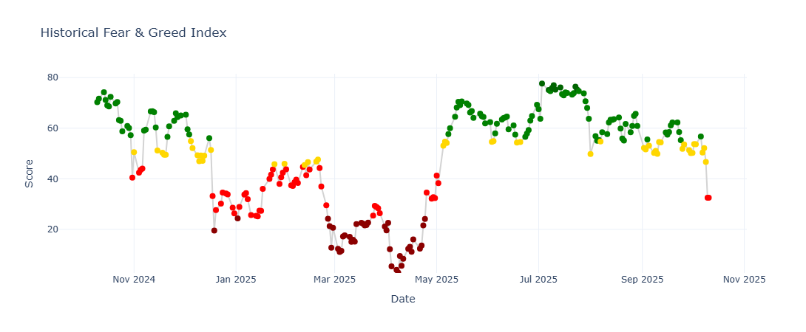

# Fear & Greed Index Dashboard



## About the Project

This project was built to extract, process, and analyze financial market sentiment indicators, focusing on the **Fear & Greed Index** and related metrics. It demonstrates practical skills in **web scraping, data analysis, and visualization**, transforming raw data from unofficial APIs into clear and actionable insights.

The workflow is presented in a **Jupyter Notebook (.ipynb)**, making the process fully **reproducible and interactive**.

---

## Features

- **Data extraction via unofficial APIs**: collects metrics such as Fear & Greed, volatility (VIX), S&P 500 momentum, junk bond demand, put/call ratio, and safe haven demand.  
- **JSON parsing and data organization**: transforms raw responses into clean Pandas DataFrames.  
- **Metric rating system**: automatically classifies values into categories — Extreme Fear, Fear, Neutral, Greed, and Extreme Greed — with support for inverted scales.  
- **Advanced Plotly visualization**:  
  - Line charts connecting time series.  
  - Colored points by rating category.  
  - Auxiliary reference lines for averages and thresholds.  
- **Data analytics with Pandas**: efficient manipulation and statistical analysis of time series data.

---

## Technologies Used

- **Python**  
- **Requests** – API data retrieval  
- **TLS Fingerprinting** – secure and reliable requests  
- **Pandas** – data cleaning and analytics  
- **Plotly** – interactive data visualization  
- **Jupyter Notebook** – organized, reproducible workflow

---

## Project Structure

```
project/
│
├── notebooks/
│   └── fear_greed_analysis.ipynb    # Main analysis notebook
│
├── images/
│   └── fear_and_greed.jpeg          # Example generated chart
│
├── scripts/
│   └── data_processing.py           # Parsing and rating functions
│
├── README.md
└── requirements.txt
```

---

## How to Run

1. Install dependencies:

```bash
pip install -r requirements.txt
```

2. Open the notebook `notebooks/fear_greed_analysis.ipynb` and run all cells to reproduce the analysis.  
3. All figures are generated automatically and can be saved as PNG/JPEG using Plotly.

---

## Example Output

This project produces charts like the one below:


Each data point is color-coded based on its rating category, giving an **instant visual snapshot of market sentiment**.

---

## Skills Demonstrated

- Unofficial API data extraction and JSON parsing  
- Time series manipulation and analysis using Pandas  
- Interactive visualization with Plotly  
- Custom rating logic based on statistical thresholds  
- Notebook-based presentation for clear communication and portfolio demonstration

---

## Contact

For freelance or collaboration opportunities in **data analytics, web scraping, or data visualization**, feel free to connect via GitHub or LinkedIn.


<div align="center">
  <a href="https://www.linkedin.com/in/brunoaugustosouza/"></a>
  &nbsp;
  <a href="mailto:bruno.augusto.souza@outlook.com"></a>
</div>

---
